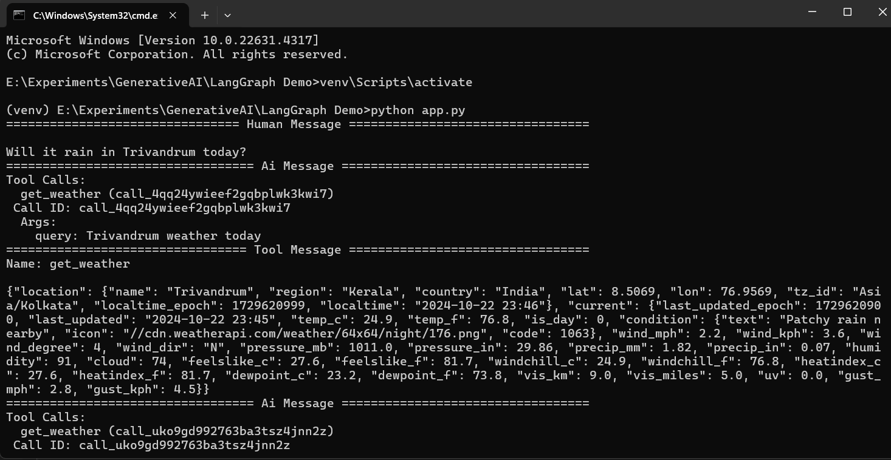

# LangGraph demo

Explore how LangGraph helps to build robust, scalable and flexible multi-agent systems, making the development of intelligent AI workflows smoother and more efficient.

## How to run

````
git clone https://github.com/codemaker2015/langgraph-demos.git
````
You will need to install all the requirements:
```commandline
pip install -r requirements.txt
```
You can run the app.py using the following command:
```commandline
python app.py
```

# Outputs




